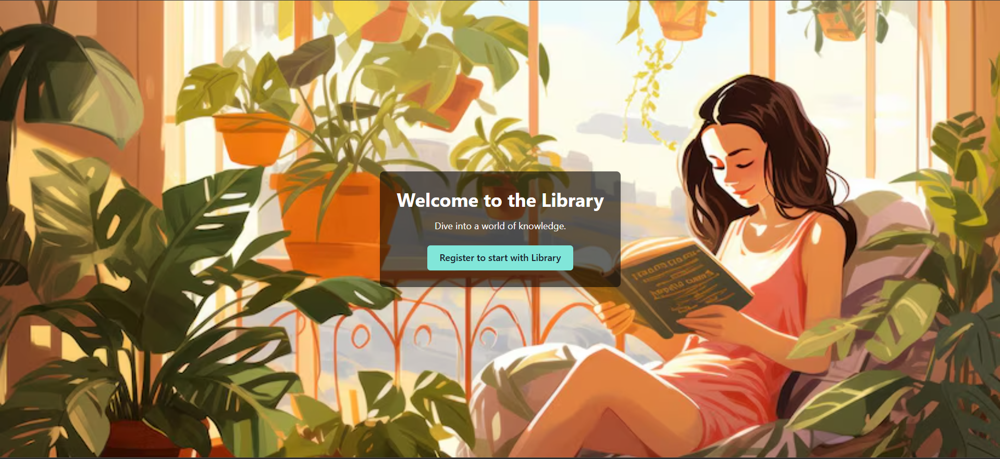
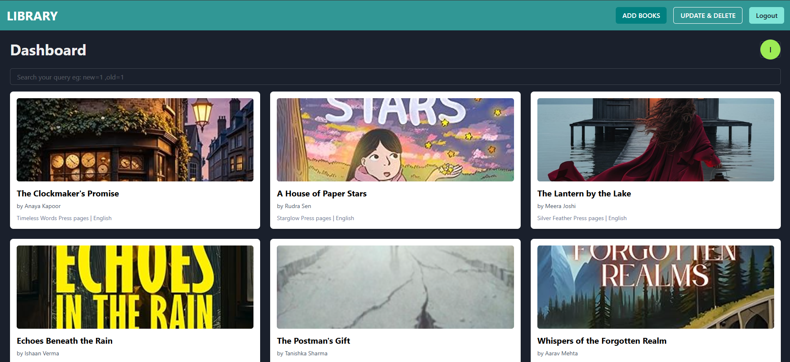
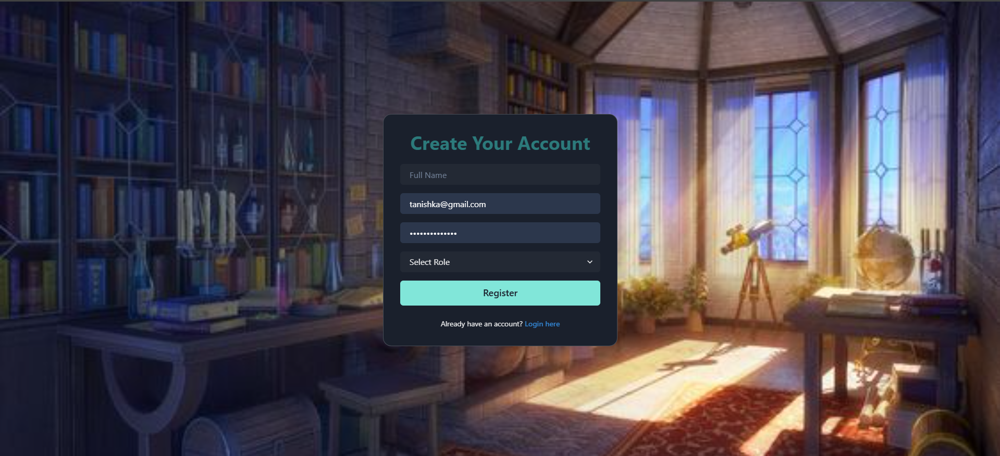
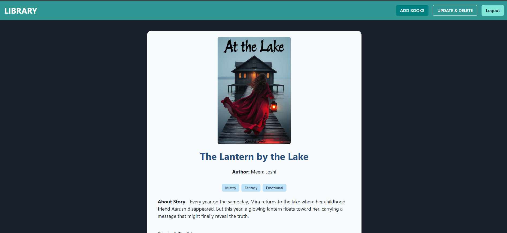

# 📚 Library App

A full-stack Library App built with **React** (frontend) and **Node.js, Express, MongoDB, Mongoose** (backend), where:

- 📝 **Creators** can create, upload, update, and delete books.
- 📖 **Viewers** can read/view books shared by creators.

## 🚀 Live Demo

🔗 [Live App Link](https://your-deployed-url.com)

## 📌 Features

### 👤 User Roles
- **Creator**: Can add, update, delete, and upload books.
- **Viewer**: Can view/read books uploaded by creators.

### 🛠 Functionalities
- Add a new book with title, author, content, and metadata.
- Update or delete a book.
- View all uploaded books.
- Role-based access control using JWT.
- Responsive and interactive UI using React and Chakra UI.
- Book upload and display with real-time updates.

## 🧰 Tech Stack

### Frontend
- React
- Chakra UI
- React Router DOM
- Axios

### Backend
- Node.js
- Express.js
- MongoDB
- Mongoose
- JWT (Authentication)
- CORS & dotenv


## ⚙️ Installation & Setup

### 🔧 Backend

1. Clone the project :

   ```bash
   git clone https://github.com/tanishkasharmaaa/Library_App.git
   ```
2. Navigate to the `backend` folder:

   ```bash
   cd backend
   ```
3. Install dependencies

   ```bash
   npm install
   ```
4. Create a .env file and add your environment variables:

   ```bash
   PORT=5000
   MONGODB_URI=your_mongo_connection_string
   JWT_SECRET=your_jwt_secret
   ```
5. Start the server

   ```bash
   npm run dev
   ```

### 💻 Frontend

1. Navigate to the frontend folder

   ```bash
   cd frontend
   ```

2. Install dependencies:

   ```bash
   npm install
   ```

3. Start the React development server:

    ```bash
    npm run dev
    ```


## 🗂️ Glimpse of Library App





## Contact
Created by [Tanishka](https://github.com/tanishkasharmaaa) - feel free to reach out on [linkedIn](https://www.linkedin.com/in/tanishka-sharma-304953274/)!